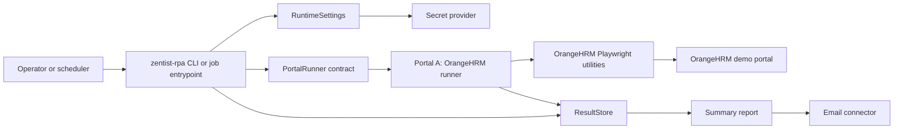
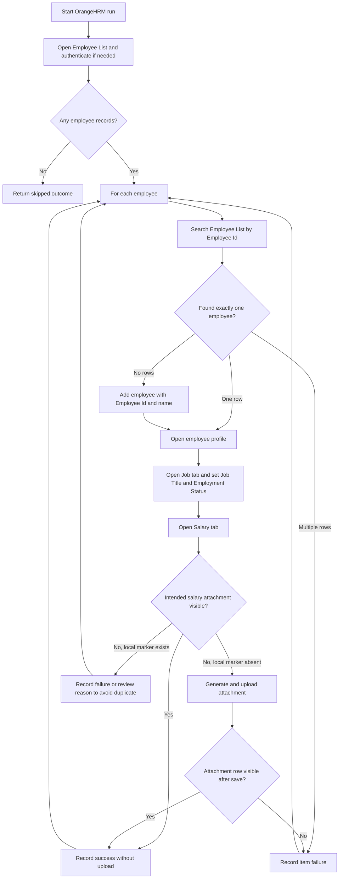
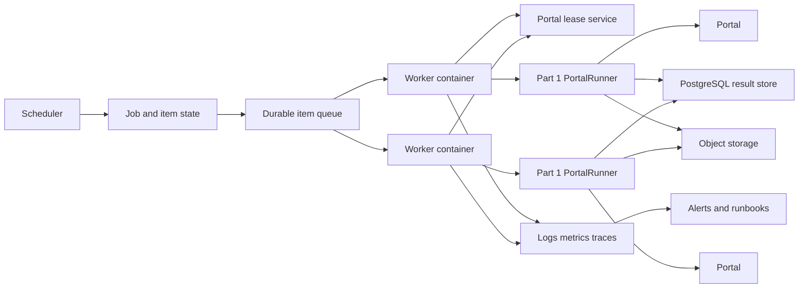
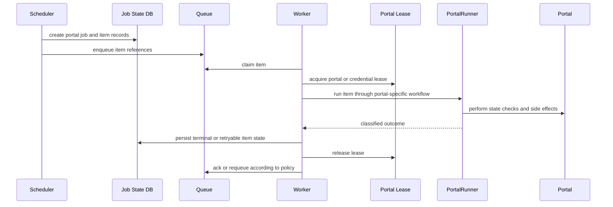

# Zentist RPA Design

> Status: Draft
> Scope: Part 1 Portal A and Part 2 production scale design
> Last updated: 2026-07-01

## Purpose

This document explains how the Part 1 OrangeHRM automation should work and how the same runner shape scales for Part 2. It is intentionally design-focused: it names boundaries, data contracts, failure behavior, idempotency rules, and production operating choices without turning the take-home codebase into a premature production platform.

Portal A means OrangeHRM. Portal B, Sauce Demo, is still part of the Part 1 codebase, but this document only covers it where the shared runner and production architecture must remain portal-neutral.

## References

- `.docs/zentist-rpa-part-1.md`: source of truth for Part 1 scope and acceptance criteria.
- `.docs/zentist-rpa-production-scale.md`: source of truth for Part 2 scale expectations.
- `.docs/architecture/*.md`: local architecture pattern notes for page objects, connectors, queues, orchestration, secrets, idempotency, and observability.
- `src/zentist_rpa/core/`: runner contract, run context, outcomes, and exception taxonomy.
- `src/zentist_rpa/connectors/`: settings, secrets, SQLite persistence, reporting, and email boundaries.
- `src/zentist_rpa/portals/orangehrm/`: Portal A models, workflow, and Playwright utilities.

## Goals

Part 1 Portal A must prove a reusable RPA foundation by processing OrangeHRM employee records through a shared runner boundary. For each input employee, the runner should find or create the employee, converge Job details to the target state, and ensure the intended salary attachment exists without creating same-day duplicates.

Part 2 must explain how that same runner boundary can operate at production scale: about 100 portals, a few hundred daily jobs, and about 30,000 daily work items. The production answer is not to rewrite the bot. It is to place the Part 1 runner layer inside a durable scheduling, queueing, worker, state, and observability control plane.

## Non-Goals

- Building the Part 2 platform in this repository.
- Replacing the Part 1 runner contract with scheduler-specific abstractions.
- Adding cloud infrastructure, dashboards, Terraform, or production deployment code.
- Storing real credentials, real salary data, or sensitive screenshots in committed files.
- Guaranteeing public demo portal stability.

## Figure ZQ9



The core design rule is that orchestration depends on `PortalRunner`, not on OrangeHRM internals. OrangeHRM owns its page selectors and business workflow; shared code owns run context, outcomes, persistence, configuration, reports, and notification.

## Current Code Shape

The repository already has the core seams needed for this design:

| Boundary | Current module | Responsibility |
|---|---|---|
| Runner contract | `src/zentist_rpa/core/runner.py` | Defines the portal-neutral `PortalRunner` protocol. |
| Run and outcome models | `src/zentist_rpa/core/models.py` | Defines `RunContext`, `WorkItemOutcome`, and status enums. |
| Result store | `src/zentist_rpa/connectors/result_store.py` | Persists run rows and per-item outcomes through a SQLite-backed connector. |
| Runtime config | `src/zentist_rpa/connectors/settings.py` | Loads `ZENTIST_RPA_` settings and fails before browser side effects when required config is missing. |
| Portal A model | `src/zentist_rpa/portals/orangehrm/models.py` | Defines `EmployeeRecord` with employee key, name, job, status, salary, and currency. |
| Portal A workflow | `src/zentist_rpa/portals/orangehrm/orangehrm.py` | Authenticates, iterates employee inputs, records a `WorkItemOutcome` per employee, and isolates item failures. |
| Portal A page actions | `src/zentist_rpa/portals/orangehrm/utilities.py` | Encapsulates OrangeHRM navigation, search, add employee, Job update, and Salary attachment behavior. |

Some repository files are still changing. This document records the intended design boundary, not a guarantee that every acceptance criterion is complete in the current working tree.

## Part 1 Portal A Design

### Input Contract

Portal A input is a collection of employee records. Each record is keyed by `employee_key`, which maps to OrangeHRM Employee Id and is the business key for processing.

Required fields:

| Field | Purpose |
|---|---|
| `employee_key` | Stable business key and OrangeHRM Employee Id. |
| `first_name` | Required when adding a missing employee. |
| `last_name` | Required when adding a missing employee. |
| `job_title` | Target Job Title value to converge in OrangeHRM. |
| `employment_status` | Target Employment Status value to converge in OrangeHRM. |
| `annual_salary` | Demo salary value written to the generated attachment. |
| `currency` | Optional display currency, defaulting to `USD`. |

Duplicate input keys should collapse to one target record before browser side effects or fail validation explicitly. Silent duplicate processing would make idempotency unclear.

### Processing Flow



The runner should process unrelated employees even when one employee fails. A single employee failure is a `WorkItemOutcome` for that employee, not a run-level crash.

### Idempotency Rule

Portal A is converge-to-state automation, not append-only automation.

For each same-day rerun:

- Search by `employee_key` / Employee Id.
- Add the employee only if it is missing.
- Always set Job Title and Employment Status to the target values.
- Generate the intended salary attachment marker deterministically.
- Upload the salary attachment only when the intended marker is not already present.
- If the local marker exists but OrangeHRM does not expose the matching attachment row, stop that item with a reviewable reason instead of uploading blindly.

The intended filename format is:

```text
zentist-salary-{employee_key}-{YYYY-MM-DD}.txt
```

The attachment content should include employee key, employee name, job title, employment status, annual salary, currency, and processing date. The generated file is demo data and must not contain real salary information.

Run id alone is not an idempotency key. Each execution may have a new `run_id`; same-day dedupe decisions must use business identifiers such as portal, employee key, processing date, and attachment marker.

### Failure Classification

Portal A should fail explicitly with enough context to debug the item:

| Failure | Outcome behavior |
|---|---|
| Missing runtime config | Fail before browser side effects. |
| Login or navigation failure | Return a run-visible failure with operation context. |
| Employee search timeout | Capture safe debug artifact reference and mark that employee failed. |
| Multiple employee rows for one key | Mark the employee failed; do not guess which row to edit. |
| Job select option missing | Mark the employee failed with the missing field and option. |
| Salary attachment cannot be verified | Mark the employee failed or review-required; do not duplicate upload. |
| One employee fails | Continue with remaining employees. |

Screenshots and generated files must be treated as artifacts. They can be referenced in outcomes, but sensitive content must not be committed or emailed raw.

### Persistence And Reporting

Each run should create one run record and one outcome row per attempted employee. Outcome rows should include:

- `run_id`
- `portal`
- `item_key`
- `status`
- `reason`
- `attempts`
- `output_refs`
- `recorded_at`

Reports should summarize totals by portal and status, then list failed or skipped employees with concise reasons. Reports must not include credentials, raw secrets, or real salary data.

### Testing Strategy

The test strategy should be layered:

| Layer | What it proves |
|---|---|
| Pure unit tests | Input validation, filename generation, attachment text, duplicate-key handling, result-store behavior, reporting output. |
| DOM fixture tests | Selector assumptions against stable OrangeHRM-like snippets without relying on the public demo site. |
| Mocked page-object tests | Per-employee success/failure orchestration and continue-after-failure behavior. |
| Tagged live smoke tests | The real browser behaviors snapshots cannot prove: login redirects, OrangeHRM custom selects, loaders, uploads, and rendered attachment rows. |

Static HTML snapshots are useful for selector regression, but they are not enough for this portal. OrangeHRM custom controls require real browser interaction because selected values can have side effects that populate dependent dropdowns.

## Part 2 Production Design

### Architecture

Part 2 adds a production control plane around the Part 1 runner layer.



The production system has two layers:

1. Runner layer: the current code pattern. It knows how to process one portal's items through page objects and return classified outcomes.
2. Control plane: scheduling, durable item expansion, queueing, leases, worker capacity, central state, artifacts, monitoring, alerting, and recovery.

The control plane should not know OrangeHRM selectors. It should only know portal profiles, work items, job status, leases, outcomes, and artifacts.

### Portal Profiles

Each portal should have a profile:

| Field | Purpose |
|---|---|
| `portal_id` | Stable portal identifier. |
| `schedule` | Cron, calendar, or external trigger. |
| `credential_refs` | Secret references, not raw credentials. |
| `max_concurrency` | Portal-level active worker limit. |
| `account_session_limit` | Constraint for portals that lock out duplicate sessions. |
| `retry_policy` | Bounded retry rules by failure class. |
| `timeout_policy` | Navigation, action, and item-level timeouts. |
| `quiet_hours` | Windows when workers should not touch the portal. |
| `circuit_breaker` | Thresholds that pause a failing portal. |
| `alert_policy` | Severity, recipient, and runbook references. |

Portal profiles let the system scale globally without over-parallelizing fragile portals.

### Throughput Model

The stated scale is about 30,000 work items per day. If the processing window is 8 hours, required average throughput is:

```text
30,000 items / 8 hours = 3,750 items/hour = about 1.05 items/second
```

If a browser item takes 20 to 60 seconds, the fleet needs roughly 25 to 75 active item processors plus headroom. That number is infrastructure capacity, not permission to run 75 sessions against one portal. Actual concurrency must be bounded by portal profiles and credential/session limits.

### Recommended Technology Choices

| Concern | Recommended default | Why |
|---|---|---|
| Scheduling | AWS EventBridge or Prefect | Supports durable schedules and visible run state. |
| Queue | SQS | Simple durable delivery, redrive policies, and worker decoupling. |
| Workers | ECS/Fargate containers | Isolates browser dependencies and scales worker count. |
| State store | RDS PostgreSQL | Central transactional state, leases, outcomes, and reports. |
| Artifacts | S3 | Stores screenshots, generated files, reports, and downloads by reference. |
| Secrets | AWS Secrets Manager | Keeps credentials outside code and supports rotation. |
| Telemetry | OpenTelemetry plus CloudWatch/Grafana | Standard logs, metrics, traces, and dashboards. |
| Exceptions | Sentry | Fast triage for code and runtime failures. |
| Paging | PagerDuty or Opsgenie | Actionable alerts for a small team. |

These are defaults for a concrete design essay. A Kubernetes-neutral alternative is acceptable if the same control-plane responsibilities are preserved.

### Rejected Or Deferred Choices

| Choice | Decision | Reason |
|---|---|---|
| Single cron host | Reject for production | One machine creates a single failure domain and weak recovery story. |
| SQLite as production state | Reject for production | It is suitable for Part 1 local runs, but not for central leases, concurrent workers, or operational reporting. |
| In-process multiprocessing only | Reject as the main scale model | Browser workers need container/process isolation and durable item state across crashes. |
| Retrying whole jobs | Reject | Item-level retry prevents one bad employee or account from replaying unrelated successful work. |
| Unlimited portal parallelism | Reject | Portal profiles must enforce session, lockout, rate-limit, and quiet-hour constraints. |
| Raw screenshot/email artifacts | Reject | Artifacts need sensitivity handling, retention, and access control. |
| Full Kubernetes platform | Defer | It may be valid later, but ECS/Fargate is simpler for the stated essay unless the target environment already runs Kubernetes. |

### Work Item Lifecycle



Every item needs a durable terminal or retryable state. A worker crash should not lose completed work because each item outcome is committed independently.

### Recovery And Idempotency

Production recovery depends on item-level state:

- Claim items atomically so two workers cannot process the same item concurrently.
- Use leases with expiry so stuck workers do not hold work forever.
- Commit outcomes after each item, not only at the end of a job.
- Use idempotency keys based on portal, business item key, processing date, and artifact marker.
- Before retrying a non-idempotent side effect, perform a portal state check.
- Move repeatedly failing items to a dead-letter or manual-review state with enough context to triage.

For Portal A, this means a rerun verifies or converges the employee state before repeating side effects. It does not trust a prior log line as proof that OrangeHRM currently contains the intended state.

### Observability And Operations

Operators need structured visibility at three levels:

| Level | Examples |
|---|---|
| Fleet | Queue depth, active workers, browser count, item throughput, error rate, capacity headroom. |
| Portal | Success rate, failure class, circuit state, lease utilization, average duration, selector drift indicators. |
| Item | Item key, current state, attempts, reason, artifact refs, last transition, correlation id. |

Alerting should be actionable for a 3-person team. Alerts should include portal id, job id, item counts, failure class, recent examples, and a runbook link. Avoid alerting on every item failure; alert on thresholds, stuck jobs, circuit breakers, data-quality failures, and missed schedule windows.

### Security And Data Handling

- Store credentials in a secret manager and pass only secret references through profiles.
- Do not log raw credentials, tokens, employee salary details, screenshots with sensitive data, or generated secrets.
- Store large artifacts in object storage with retention and sensitivity metadata.
- Restrict artifact access by operator role and expiration policy.
- Treat local SQLite, file email, and local artifact directories as development adapters, not production storage.

## Acceptance Checklist

Part 1 Portal A is acceptable when:

- Each configured employee produces a persisted `WorkItemOutcome`.
- Missing employees are added and then reopened by Employee Id.
- Existing employees are updated without creating duplicates.
- Job Title and Employment Status converge to the input values.
- The salary attachment filename is deterministic by employee key and processing date.
- Same-day reruns do not upload a duplicate intended attachment.
- Ambiguous attachment visibility becomes a reviewable item outcome.
- One employee failure does not stop other employees.

Part 2 is acceptable when the design explains:

- Why the Part 1 runner contract remains the portal execution boundary.
- How jobs are scheduled and expanded into durable items.
- How workers claim, lease, process, persist, retry, and recover items.
- How per-portal concurrency and rate limits are enforced.
- How 30,000 daily items map to throughput and worker capacity.
- How same-day reruns avoid duplicating completed work.
- How secrets, artifacts, monitoring, alerts, and runbooks work.
- Which technologies are chosen or rejected and why.

## Open Risks

- OrangeHRM is a public demo portal, so data and selectors can drift outside this repository's control.
- Salary attachment idempotency depends on the portal exposing enough attachment metadata after save.
- Full production technology choices should be revisited if the target environment is not AWS-native.
- The Part 1 code currently mixes async Playwright implementation details with an earlier sync-default design preference; the important boundary is the runner contract, not the async implementation choice.
