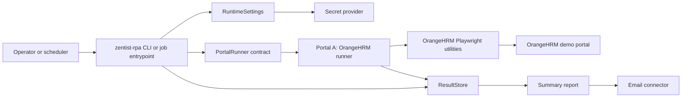
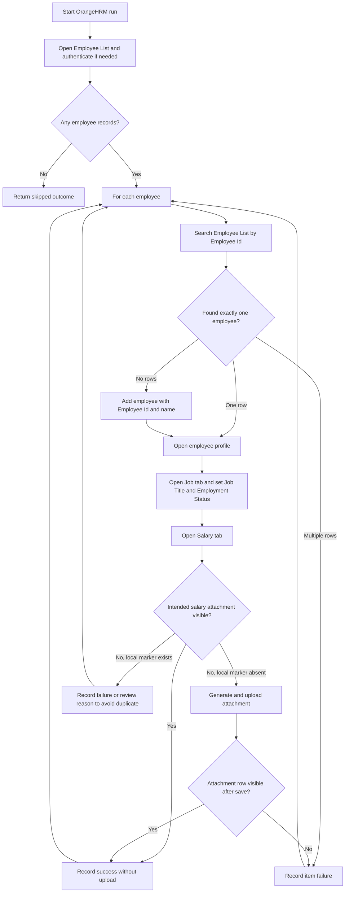
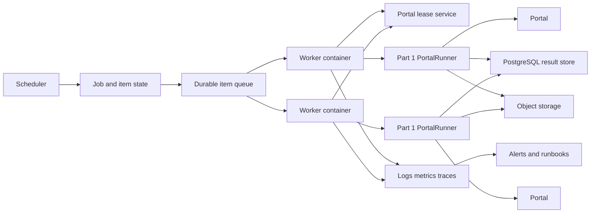
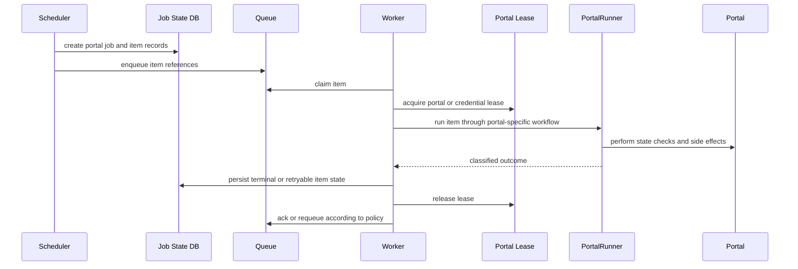

# Zentist RPA Design

> Status: Draft
> Scope: Part 1 Portal A and Part 2 production scale design
> Last updated: 2026-07-02

## Purpose

This document describes the OrangeHRM automation for Part 1 and the production shape expected for Part 2. It is not meant to turn the take-home project into a platform. It records the boundaries that matter: runner contracts, data inputs, failure behavior, idempotency, persistence, reporting, and the operating model needed when the same pattern runs at scale.

Portal A is OrangeHRM. Portal B is Sauce Demo. Sauce Demo still matters because it proves the shared runner shape is not OrangeHRM-specific, but this design focuses on OrangeHRM unless a production choice has to stay portal-neutral.

## References

- `src/zentist_rpa/core/`: runner contract, run context, outcomes, and exception taxonomy.
- `src/zentist_rpa/connectors/`: settings, secrets, SQLite persistence, reports, and email boundaries.
- `src/zentist_rpa/portals/orangehrm/`: Portal A models, workflow, and Playwright utilities.

## Figure ZQ9



The main rule is simple: shared orchestration depends on `PortalRunner`, not on OrangeHRM internals. OrangeHRM owns selectors and business workflow. Shared code owns run context, outcomes, configuration, persistence, reports, and notifications.

## Current Code Shape

The repository already has the important boundaries for this design:

| Boundary               | Current module                                   | Responsibility                                                                                                   |
| ---------------------- | ------------------------------------------------ | ---------------------------------------------------------------------------------------------------------------- |
| Runner contract        | `src/zentist_rpa/core/runner.py`                 | Defines the portal-neutral `PortalRunner` protocol.                                                              |
| Run and outcome models | `src/zentist_rpa/core/models.py`                 | Defines `RunContext`, `WorkItemOutcome`, and status enums.                                                       |
| Result store           | `src/zentist_rpa/connectors/result_store.py`     | Persists run rows and per-item outcomes through a SQLite-backed connector.                                       |
| Runtime config         | `src/zentist_rpa/connectors/settings.py`         | Loads `ZENTIST_RPA_` settings and fails before browser side effects when required config is missing.             |
| Portal A model         | `src/zentist_rpa/portals/orangehrm/models.py`    | Defines `EmployeeRecord` with employee key, name, job, status, salary, and currency.                             |
| Portal A workflow      | `src/zentist_rpa/portals/orangehrm/orangehrm.py` | Authenticates, iterates employee inputs, records one `WorkItemOutcome` per employee, and isolates item failures. |
| Portal A page actions  | `src/zentist_rpa/portals/orangehrm/utilities.py` | Encapsulates OrangeHRM navigation, search, add employee, Job update, and Salary attachment behavior.             |

Some files are still moving. This document describes the intended design boundary, not a promise that every acceptance criterion is complete in the current working tree.

## Part 1 Portal A Design

### Input Contract

Portal A accepts employee records. Each record is keyed by `employee_key`, which maps to the OrangeHRM Employee Id and acts as the business key for the run.

Required fields:

| Field               | Purpose                                                |
| ------------------- | ------------------------------------------------------ |
| `employee_key`      | Stable business key and OrangeHRM Employee Id.         |
| `first_name`        | Required when adding a missing employee.               |
| `last_name`         | Required when adding a missing employee.               |
| `job_title`         | Target Job Title value in OrangeHRM.                   |
| `employment_status` | Target Employment Status value in OrangeHRM.           |
| `annual_salary`     | Demo salary value written to the generated attachment. |
| `currency`          | Optional display currency, defaulting to `USD`.        |

Duplicate input keys should be handled before browser side effects. Either collapse them to one target record by a clear rule or fail validation explicitly. Silent duplicate processing makes reruns hard to reason about.

### Processing Flow



One employee failure should not stop the rest of the run. It becomes a `WorkItemOutcome` for that employee. A run-level crash is reserved for problems that prevent the runner from operating at all, such as missing configuration before the browser starts.

### Idempotency Rule

Portal A is converge-to-state automation. It should not behave like an append-only uploader.

On a same-day rerun, the runner should:

- Search by `employee_key` / Employee Id.
- Add the employee only when the employee is missing.
- Set Job Title and Employment Status to the target values.
- Generate the intended salary attachment marker deterministically.
- Upload the salary attachment only when that marker is not already present.
- Stop the item with a reviewable reason when the local marker exists but OrangeHRM does not show the matching row.

The intended filename format is:

```text
zentist-salary-{employee_key}-{YYYY-MM-DD}.txt
```

The attachment content should include employee key, employee name, job title, employment status, annual salary, currency, and processing date. This is demo data. It must not contain real salary information.

`run_id` is not an idempotency key. Each execution can have a fresh `run_id`; same-day dedupe decisions need business identifiers such as portal, employee key, processing date, and attachment marker.

### Failure Classification

Portal A failures need enough context for an operator or developer to act:

| Failure                              | Outcome behavior                                                          |
| ------------------------------------ | ------------------------------------------------------------------------- |
| Missing runtime config               | Fail before browser side effects.                                         |
| Login or navigation failure          | Return a run-visible failure with operation context.                      |
| Employee search timeout              | Capture a safe debug artifact reference and mark that employee failed.    |
| Multiple employee rows for one key   | Mark the employee failed; do not guess which row to edit.                 |
| Job select option missing            | Mark the employee failed with the missing field and option.               |
| Salary attachment cannot be verified | Mark the employee failed or review-required; do not duplicate the upload. |
| One employee fails                   | Continue with the remaining employees.                                    |

Screenshots and generated files are artifacts. Outcomes may reference them, but sensitive content should not be committed or emailed raw.

### Persistence And Reporting

Each run should create one run record and one outcome row per attempted employee. Outcome rows should include:

- `run_id`
- `portal`
- `item_key`
- `status`
- `reason`
- `attempts`
- `output_refs`
- `recorded_at`

Reports should summarize totals by portal and status, then list failed or skipped employees with short reasons. They must not include credentials, raw secrets, or real salary data.

### Testing Strategy

Use layers. Static checks catch some risks, but the OrangeHRM UI has custom controls and asynchronous behavior that need browser coverage.

| Layer                    | What it proves                                                                                                                      |
| ------------------------ | ----------------------------------------------------------------------------------------------------------------------------------- |
| Pure unit tests          | Input validation, filename generation, attachment text, duplicate-key handling, result-store behavior, reporting output.            |
| DOM fixture tests        | Selector assumptions against stable OrangeHRM-like snippets without depending on the public demo site.                              |
| Mocked page-object tests | Per-employee success/failure orchestration and continue-after-failure behavior.                                                     |
| Tagged live smoke tests  | Browser behavior snapshots cannot prove: login redirects, OrangeHRM custom selects, loaders, uploads, and rendered attachment rows. |

HTML snapshots are useful for selector regression. They are not enough by themselves because selected values can trigger dependent dropdowns, loaders, and rendered state that only appear in a real browser session.

## Part 2 Production Design

### Architecture

Part 2 puts a production control plane around the Part 1 runner layer.



There are two layers:

1. Runner layer: the current code pattern. It knows how to process one portal's items through page objects and return classified outcomes.
2. Control plane: scheduling, durable item expansion, queueing, leases, worker capacity, central state, artifacts, monitoring, alerting, and recovery.

The control plane should not know OrangeHRM selectors. It should know portal profiles, work items, job status, leases, outcomes, and artifacts.

### Portal Profiles

Each portal needs a profile:

| Field                   | Purpose                                                  |
| ----------------------- | -------------------------------------------------------- |
| `portal_id`             | Stable portal identifier.                                |
| `schedule`              | Cron, calendar, or external trigger.                     |
| `credential_refs`       | Secret references, not raw credentials.                  |
| `max_concurrency`       | Portal-level active worker limit.                        |
| `account_session_limit` | Constraint for portals that lock out duplicate sessions. |
| `retry_policy`          | Bounded retry rules by failure class.                    |
| `timeout_policy`        | Navigation, action, and item-level timeouts.             |
| `quiet_hours`           | Windows when workers should not touch the portal.        |
| `circuit_breaker`       | Thresholds that pause a failing portal.                  |
| `alert_policy`          | Severity, recipient, and runbook references.             |

Portal profiles let the system scale across many portals without over-parallelizing fragile ones.

### Throughput Model

The stated target is about 30,000 work items per day. If the processing window is 8 hours, the required average throughput is:

```text
30,000 items / 8 hours = 3,750 items/hour = about 1.05 items/second
```

If one browser item takes 20 to 60 seconds, the fleet needs roughly 25 to 75 active item processors plus headroom. That is infrastructure capacity, not permission to run 75 sessions against one portal. Portal profiles and credential/session limits still set the real concurrency cap.

### Recommended Technology Choices

| Concern     | Recommended default                   | Why                                                                       |
| ----------- | ------------------------------------- | ------------------------------------------------------------------------- |
| Scheduling  | AWS EventBridge or Prefect            | Durable schedules and visible run state.                                  |
| Queue       | SQS                                   | Simple durable delivery, redrive policies, and worker decoupling.         |
| Workers     | ECS/Fargate containers                | Browser dependency isolation and horizontal scaling.                      |
| State store | RDS PostgreSQL                        | Central transactional state, leases, outcomes, and reports.               |
| Artifacts   | S3                                    | Stores screenshots, generated files, reports, and downloads by reference. |
| Secrets     | AWS Secrets Manager                   | Keeps credentials outside code and supports rotation.                     |
| Telemetry   | OpenTelemetry plus CloudWatch/Grafana | Standard logs, metrics, traces, and dashboards.                           |
| Exceptions  | Sentry                                | Quick triage for code and runtime failures.                               |
| Paging      | PagerDuty or Opsgenie                 | Actionable alerts for a small team.                                       |

These are concrete defaults for the design essay. A Kubernetes-based design can also work if it keeps the same responsibilities and does not hide item state inside workers.

### Rejected Or Deferred Choices

| Choice                          | Decision                       | Reason                                                                                                                  |
| ------------------------------- | ------------------------------ | ----------------------------------------------------------------------------------------------------------------------- |
| Single cron host                | Reject for production          | One machine creates a single failure domain and weak recovery story.                                                    |
| SQLite as production state      | Reject for production          | Good for Part 1 local runs, not for central leases, concurrent workers, or operational reporting.                       |
| In-process multiprocessing only | Reject as the main scale model | Browser workers need process/container isolation and durable item state across crashes.                                 |
| Retrying whole jobs             | Reject                         | Item-level retry prevents one bad employee or account from replaying unrelated successful work.                         |
| Unlimited portal parallelism    | Reject                         | Portal profiles must enforce session, lockout, rate-limit, and quiet-hour constraints.                                  |
| Raw screenshot/email artifacts  | Reject                         | Artifacts need sensitivity handling, retention, and access control.                                                     |
| Full Kubernetes platform        | Defer                          | It may be right later, but ECS/Fargate is simpler for this scope unless the target environment already runs Kubernetes. |

### Work Item Lifecycle



Every item needs a durable terminal or retryable state. A worker crash should not erase completed work because each item outcome is committed independently.

### Recovery And Idempotency

Production recovery depends on item-level state:

- Claim items atomically so two workers cannot process the same item concurrently.
- Use leases with expiry so stuck workers do not hold work forever.
- Commit outcomes after each item, not only at the end of a job.
- Use idempotency keys based on portal, business item key, processing date, and artifact marker.
- Check portal state before retrying a non-idempotent side effect.
- Move repeatedly failing items to a dead-letter or manual-review state with enough context to triage.

For Portal A, a rerun verifies or converges employee state before repeating side effects. It does not treat an old log line as proof that OrangeHRM still contains the intended state.

### Observability And Operations

Operators need visibility at three levels:

| Level  | Examples                                                                                                    |
| ------ | ----------------------------------------------------------------------------------------------------------- |
| Fleet  | Queue depth, active workers, browser count, item throughput, error rate, capacity headroom.                 |
| Portal | Success rate, failure class, circuit state, lease utilization, average duration, selector drift indicators. |
| Item   | Item key, current state, attempts, reason, artifact refs, last transition, correlation id.                  |

Alerting should be practical for a 3-person team. Alerts should include portal id, job id, item counts, failure class, recent examples, and a runbook link. Do not page on every item failure. Page on thresholds, stuck jobs, circuit breakers, data-quality failures, and missed schedule windows.

### Security And Data Handling

- Store credentials in a secret manager and pass only secret references through profiles.
- Do not log raw credentials, tokens, employee salary details, screenshots with sensitive data, or generated secrets.
- Store large artifacts in object storage with retention and sensitivity metadata.
- Restrict artifact access by operator role and expiration policy.
- Treat local SQLite, file email, and local artifact directories as development adapters, not production storage.

## Acceptance Checklist

Part 1 Portal A is acceptable when:

- Each configured employee produces a persisted `WorkItemOutcome`.
- Missing employees are added and then reopened by Employee Id.
- Existing employees are updated without creating duplicates.
- Job Title and Employment Status converge to the input values.
- The salary attachment filename is deterministic by employee key and processing date.
- Same-day reruns do not upload a duplicate intended attachment.
- Ambiguous attachment visibility becomes a reviewable item outcome.
- One employee failure does not stop other employees.

Part 2 is acceptable when the design explains:

- Why the Part 1 runner contract remains the portal execution boundary.
- How jobs are scheduled and expanded into durable items.
- How workers claim, lease, process, persist, retry, and recover items.
- How per-portal concurrency and rate limits are enforced.
- How 30,000 daily items map to throughput and worker capacity.
- How same-day reruns avoid duplicating completed work.
- How secrets, artifacts, monitoring, alerts, and runbooks work.
- Which technologies are chosen or rejected and why.

## Open Risks

- OrangeHRM is a public demo portal, so data and selectors can drift outside this repository's control.
- Salary attachment idempotency depends on the portal exposing enough attachment metadata after save.
- Production technology choices should be revisited if the target environment is not AWS-native.
- The Part 1 code currently mixes async Playwright implementation details with an earlier sync-default preference. The important boundary is the runner contract, not the async implementation choice.
